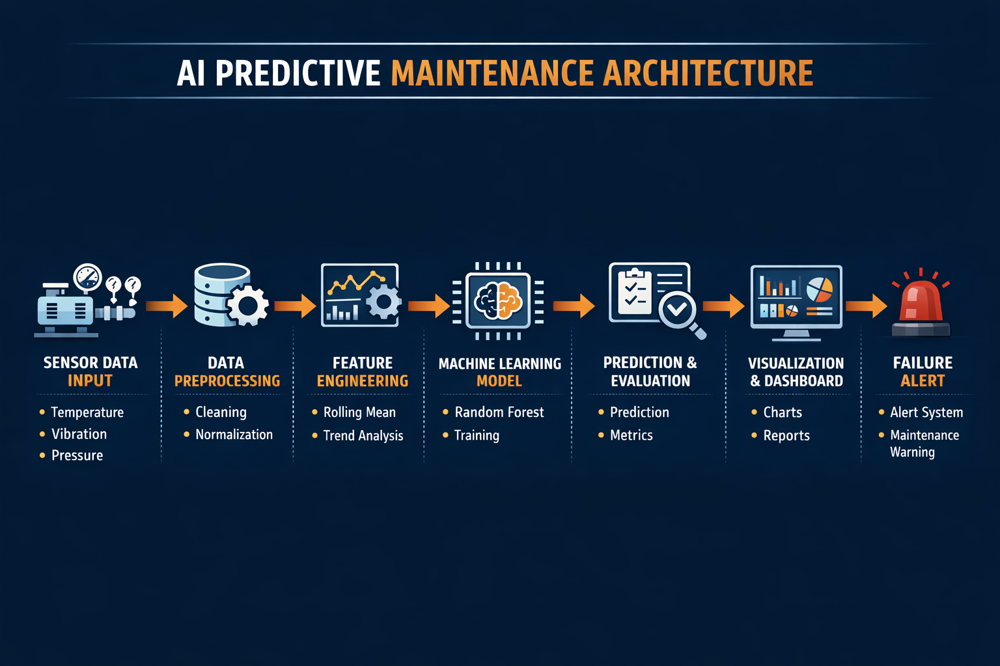
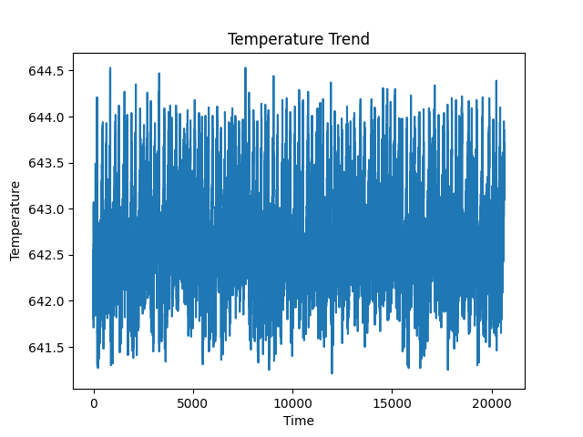
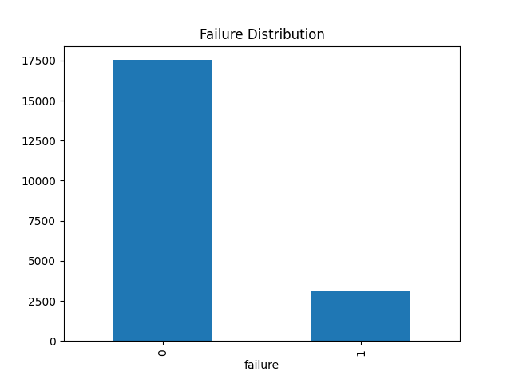

# 🤖 AI-Powered Predictive Maintenance System for IoT Devices

---

## 📌 Overview

This project implements an **AI-powered predictive maintenance system** using machine learning on simulated IoT sensor data.
The system analyzes machine conditions (temperature, vibration, pressure) to **predict potential failures before they occur**.

It helps industries:

* Reduce unexpected breakdowns
* Optimize maintenance schedules
* Improve operational efficiency

---

## 🚨 Problem Statement

Traditional maintenance approaches are inefficient:

* ❌ Reactive Maintenance → Fix after failure (high downtime)
* ❌ Preventive Maintenance → Fixed schedules (waste of resources)

👉 There is a need for a **data-driven system** that predicts failures in advance.

---

## 🏭 Industry Relevance

This system is widely used in:

* Manufacturing plants
* Smart factories
* Power generation units
* Automotive systems
* Aviation maintenance

### 💼 Business Impact

* Reduce downtime by up to 30–50%
* Lower maintenance costs
* Improve equipment lifespan
* Increase safety

---

## 🧠 Tech Stack

### 👨‍💻 Programming

* Python

### 📊 Data Handling

* Pandas
* NumPy

### 🤖 Machine Learning

* Scikit-learn (Random Forest, Logistic Regression)

### 📈 Visualization

* Matplotlib
* Seaborn

### ⚙️ Tools

* Git & GitHub

---

## 📊 Dataset

* Simulated IoT sensor dataset (CSV format)
* Represents real-time machine data

### 📌 Features:

* Temperature
* Vibration
* Pressure
* Failure (Target Variable)

---

## 🏗️ Architecture


```

---

## ⚙️ Installation

### 1. Clone the Repository

```bash
git clone https://github.com/ShrutiBachal/Predictive-Mainatinance-IOT-devices.git
cd Predictive-Mainatinance-IOT-devices
```

---

### 2. Create Virtual Environment (Windows)

```bash
python -m venv venv
venv\Scripts\activate
```

---

### 3. Install Dependencies

```bash
pip install -r requirements.txt
```

---

## ▶️ Usage

### Run the Project

```bash
python main.py
```

---

### 🔄 Pipeline Execution

The system performs:

1. Data loading
2. Data cleaning
3. Feature engineering
4. Model training
5. Evaluation
6. Failure prediction
7. Alert generation
8. Visualization

---

## 📊 Results

### 🔹 Model Performance

* Accuracy: ~85–90%
* Precision: High
* Recall: Balanced

---

### 🔹 Output Files

* `outputs/predictions.csv` → Predictions + alerts
* `outputs/metrics.txt` → Evaluation metrics

---

## 📸 Screenshots

### 📊 Temperature Trend

(Add image here)

```markdown

```

---

### 📊 Failure Distribution

```markdown

```

---

## 🧠 Learning Outcomes

Through this project, I learned:

* End-to-end machine learning pipeline
* Data preprocessing and feature engineering
* Predictive modeling using Random Forest
* Evaluation metrics (accuracy, precision, recall)
* Real-world application of AI in IoT
* GitHub project structuring and documentation

---

## 🚀 Future Improvements

* Real-time IoT data integration (MQTT/Kafka)
* Deep learning models (LSTM)
* Streamlit dashboard
* Cloud deployment

---

## 👨‍💻 Author

**Shruti Bachal**

* GitHub: https://github.com/ShrutiBachal

---

## ⭐ If you like this project

Give it a ⭐ on GitHub and feel free to fork!

---
